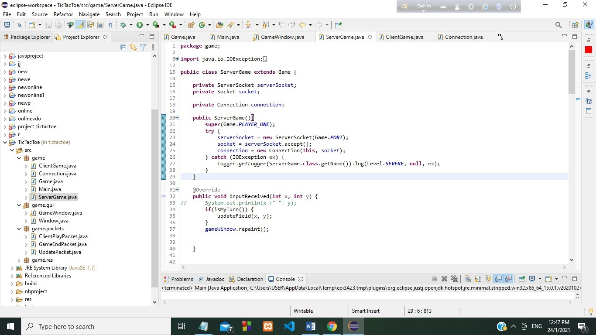
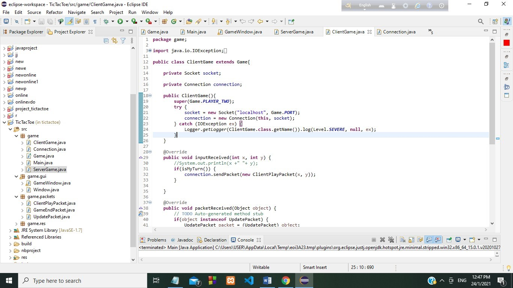
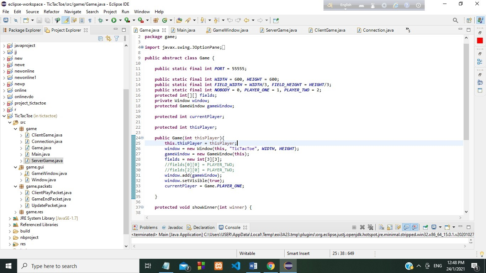
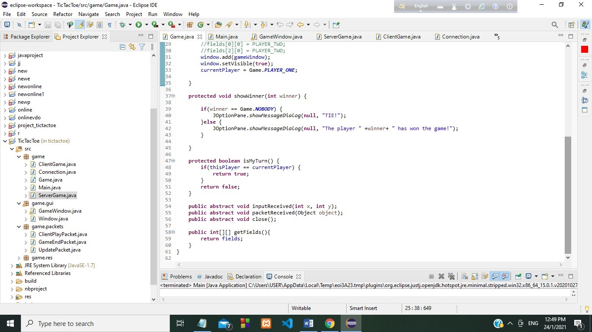
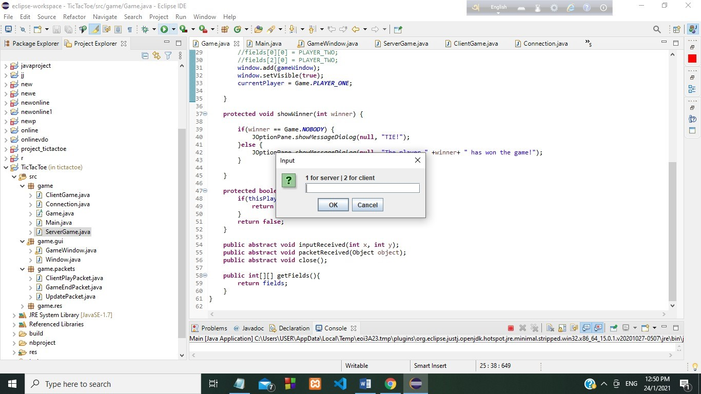
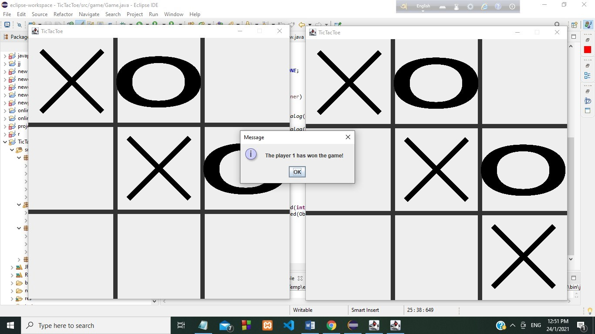

<h1> Networked Tic-Tac-Toe </h1>

<h2>This project was developed as part of my undergraduate studies.</h2>
<h3> Procedure: </h3>

It’s a Tic-Tac-Toe game where one can play with another player. The game is played on a grid that's 3 squares by 3 squares. You are X, your friend (or the computer in this case) is O. Players take turns putting their marks in empty squares. The first player to get 3 of her marks in a row (up, down, across, or diagonally) is the winner. 
When all 9 squares are full, the game is over. Game should be coded with two 
levels: a server level and a client level. Communications implemented with TCP. 
Necessary software and equipments: 

<ol>
<li> Eclipse </li>
<li> Java as programming language </li>
<li> Java swing as GUI </li>
<li> Communication will be implemented with tcp </li>
</ol>

<h2>The Handshaking</h2>
<h3>Serverside</h3>

<h3>Clientside</h3>

<h3>The game class</h3>

<h2>Result</h2>
<h3>Asking for server or client to run the game</h3>

<h3>Here, player 1 has won</h3>

